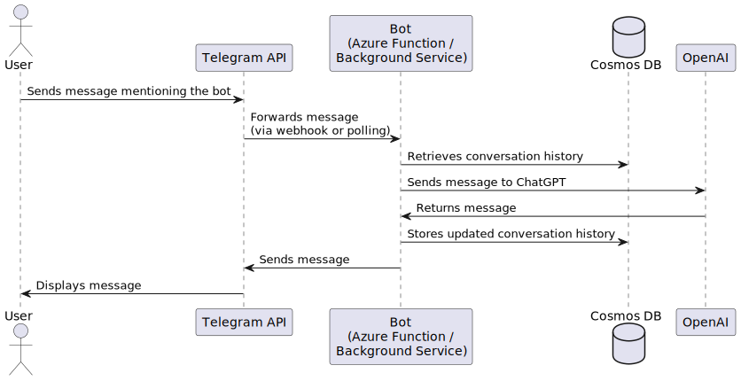

# Ungerfall ChatGPT

Telegram bot that uses OpenAI's ChatGPT that uses brief and concise system role.
The bot can be run as a polling background service or as an Azure Function using Telegram bot webhooks.
It stores conversation history in Cosmos DB.

## Features

- Automatically responds to messages mentioning the bot.
- Stores conversation history in Cosmos DB for data persistence and retrieval.
- Sends typing events to indicate when the bot is processing a message.
- Supports two deployment methods:
  - Polling background service.
  - Azure Functions with serverless deployment and scaling using Telegram bot webhooks.
  
## Sequence diagram

## Contributing

Feel free to create issues or submit pull requests for any improvements or bug fixes you would like to contribute.
